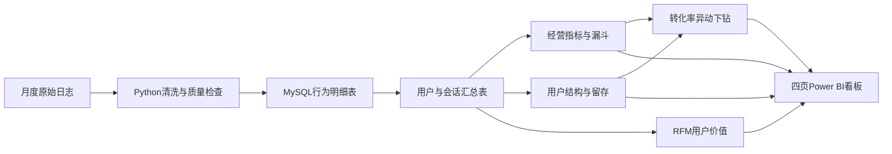
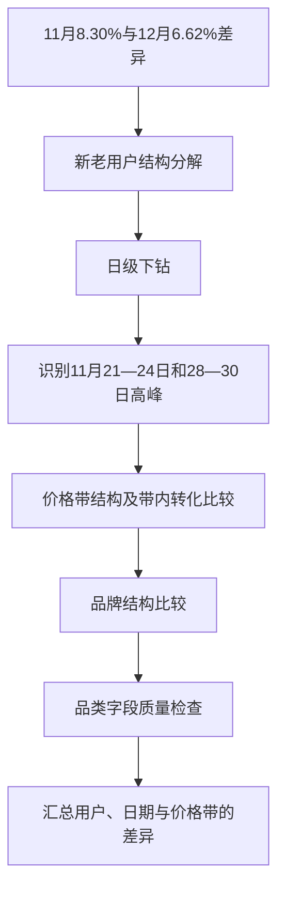
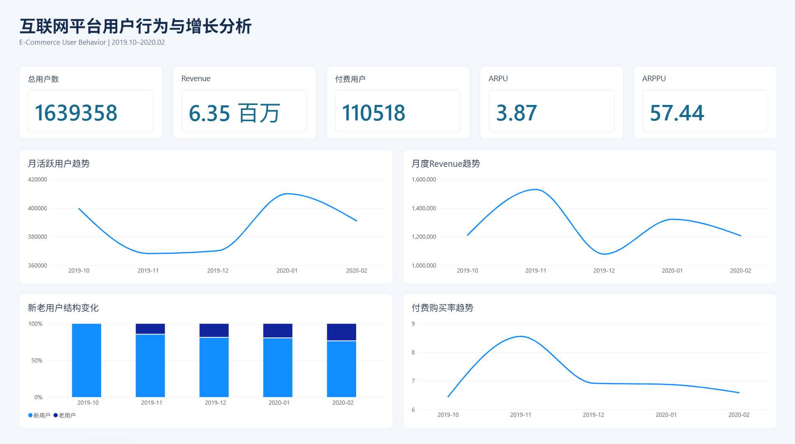
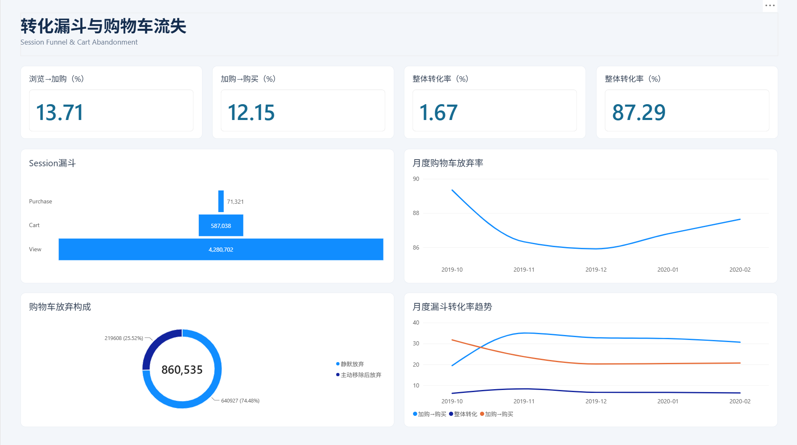
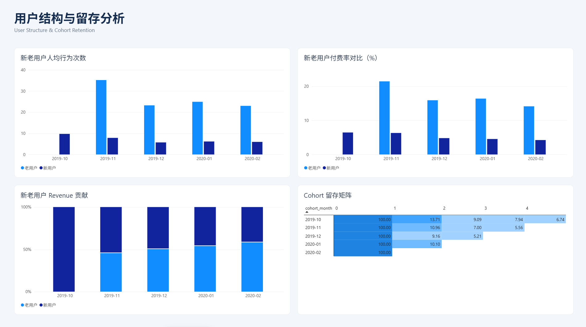
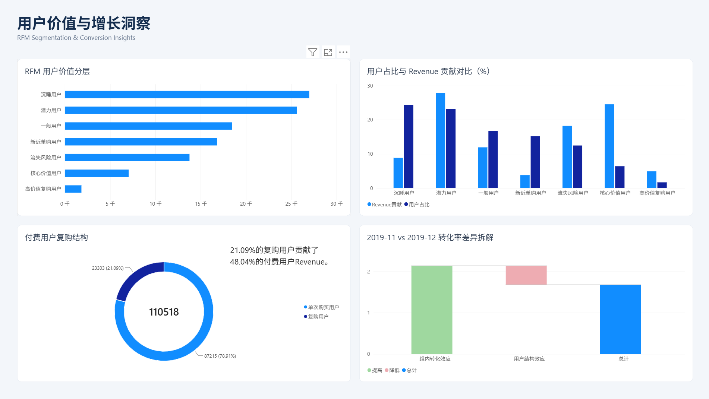

# 互联网平台用户行为与增长分析

基于近 2,000 万条用户行为日志，使用 **Python + MySQL + Power BI** 分析活跃、转化、留存与用户价值，并通过用户结构、时间和商品价格带下钻，定位转化差异并提炼运营洞察。

这是面向数据分析、商业分析及运营分析岗位的个人作品集。数据来自化妆品电商，重点是可迁移的平台行为分析方法。

**项目状态：** 已完成经营指标、三种漏斗、购物车流失、用户结构、同期群留存、RFM、指标异动和四页 Power BI 看板。

## 数据与技术栈

| 项目 | 内容 |
|---|---|
| 数据源 | [Kaggle：E-Commerce Events History in Cosmetics Shop](https://www.kaggle.com/datasets/mkechinov/ecommerce-events-history-in-cosmetics-shop) |
| 观察期 | 2019-10—2020-02，共五个月 |
| 原始日志 | 20,692,840 条 |
| 规范化后去重 | 1,109,098 条，约 5.36% |
| 清洗后日志 | 19,583,742 条 |
| 观察期独立用户 | 1,639,358 人；不等于注册用户 |
| 技术栈 | Python、pandas、MySQL 8.0+、SQL、Power BI、Git / GitHub |

原始与清洗后行为明细因体积较大不上传；获取方式见 [data/README.md](data/README.md)。仓库中的小型清洗汇总只包含月度统计。

## 分析框架



分析依次回答：谁在活跃、哪里没有完成转化、用户是否回来、哪些购买用户贡献收入，以及指标变化主要体现在哪些用户组和日期。

## 核心发现

1. **统计口径会显著改变漏斗读数。** 用户级宽口径、用户级首次时间严格近似、Session（访问会话）级首次时间严格近似的整体转化率分别为 **6.56%、4.49%、1.67%**，不能混为同一种即时转化率。
2. **购物车流失规模较大。** 全部加购会话放弃率为 **87.29%**；其中 **74.48%** 被首次时间算法归为“静默放弃”，并不保证整个会话从未出现移除。
3. **人数占比不等于收入贡献。** 2020-02 已观察老用户占月活跃用户 MAU 的 **23.83%**，贡献正价格购买收入 Revenue 的 **58.26%**。
4. **首次活跃后的次月回访较弱。** Cohort（按首次观察月份划分的同期群）中，2019-11—2020-01 的次月 M1 留存约 **9%—11%**；2019-10 受观察窗口起点影响，不能直接作为真实新客同期群比较。
5. **收入向部分高价值用户集中。** RFM（最近购买间隔、购买频次、累计金额）核心价值用户占付费用户 **6.38%**，贡献收入 **24.52%**。
6. **复购用户贡献高于人数占比。** 以不同正价格购买 Session 近似订单频次，复购用户占 **21.09%**，贡献收入 **48.04%**。
7. **11月高转化主要体现为组内差异。** 2019-11 比12月的月度宽口径整体转化率高 **1.68 个百分点**；按既定分解公式，结构效应为 **−0.46**、组内转化效应为 **+2.14 个百分点**。

详细分析见[项目分析报告](docs/项目分析报告.md)。

## 指标异动分析：结构拆解与多维下钻



高峰日期的正价格购买更集中于 `(0,5)` 价格带：购买事件占比由普通日期的 **70.14%** 升至 **75.49%**。但在各价格带内，高峰日期的用户日转化率仍普遍较高；价格结构变化不足以单独解释差异。

2019-11 的 `category_code` 缺失率为 **98.32%**，因此没有将其用于最终品类归因。没有营销活动、渠道或支付失败字段，不能把高峰解释为某次促销或某个运营活动的效果。

## Power BI 看板展示

文件：[用户行为与增长分析.pbix](powerbi/用户行为与增长分析.pbix)。

| 页面 | 内容 |
|---|---|
| 经营概览 | 用户规模、收入、MAU、新老用户结构及付费趋势 |
| 转化漏斗与购物车流失 | Session 漏斗、放弃率、静默放弃及月度变化 |
| 用户结构与 Cohort 留存 | 活跃度、付费率、收入贡献和留存矩阵 |
| 用户价值与增长洞察 | RFM 分层、复购结构及转化率差异分解 |

<details>
<summary>展开四页看板</summary>

### 经营概览


### 转化漏斗与购物车流失


### 用户结构与留存


### 用户价值与增长洞察


</details>

连接与刷新方法见 [powerbi/README.md](powerbi/README.md)。

## 核心指标口径

- 新用户：观察期内首次活跃的用户。
- Revenue：正价格购买事件的价格之和；ARPU以活跃用户为分母，ARPPU以正价格购买用户为分母。
- 复购频次：使用不同购买Session近似订单次数。

详细定义见[指标口径说明](docs/指标口径说明.md)，数据质量见[数据质量与局限性](docs/数据质量与局限性.md)。

## 工程实现与运行

原始明细接近2,000万行，直接重复执行用户级条件聚合曾出现超过10分钟的运行情况。项目采用“明细事实表 → 分析粒度汇总 → 查询与看板”的结构，复用用户月度画像、首次行为和 RFM 汇总。索引按事件过滤、用户/日期查询设计。

```bash
python -m pip install -r requirements.txt
python python/clean_data.py
python python/data_quality_check.py
```

默认清洗目录已有文件时程序拒绝覆盖；复跑请指定新的 `--output-dir`。已有数据库用户优先阅读 [Workbench 运行指南](docs/workbench_guide.md) 和 [SQL 执行索引](sql/README.md)，不要重复导入、盲目重建汇总或整批执行初始化脚本。

## 项目目录

```text
.
├── README.md
├── LICENSE / .gitignore / requirements.txt
├── docs/
│   ├── 项目分析报告.md
│   ├── 指标口径说明.md
│   ├── 数据质量与局限性.md
│   └── data_dictionary.md / cleaning_summary.csv
├── sql/                 # 00—20号分析脚本与执行索引
├── python/              # 清洗与只读质量检查
├── powerbi/             # 最新PBIX、百分比度量示例及说明
├── assets/dashboard/    # 四页看板截图
└── data/README.md       # 下载说明；明细文件不上传
```

代码与文档采用 MIT 许可证；数据源遵循原发布方条款。
